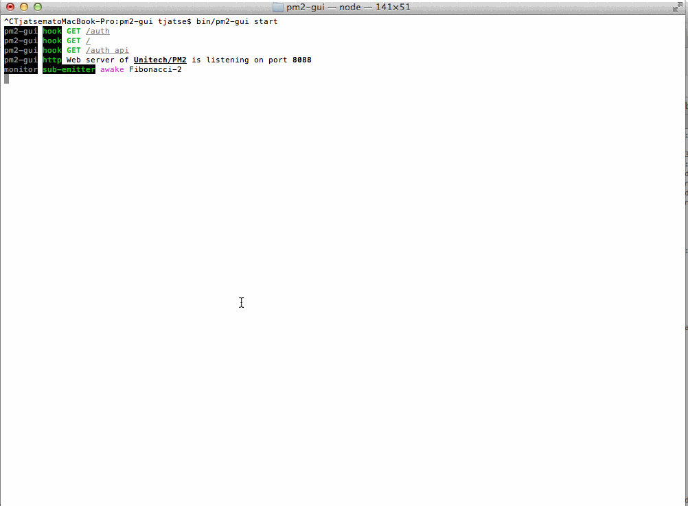

pm2-gui [](http://badge.fury.io/js/pm2-gui) [](https://travis-ci.org/Tjatse/pm2-gui)
=======

An elegant web & terminal interface for Unitech/PM2.

> Compatible with PM2 v0.12.7+
> If you wanna update to pm2-gui@latest, make sure you've read the [change logs](CHANGELOG.md).



# Guide
- [Features](#feats)
- [Cautions](#cauts)
- [Installation](#ins)
- [Usage](#usage)
- [Configuration](#config)
- [Authorization](#auth)
- [UI/UX](#ui)
- [Serving apps locally with nginx and custom domain](#serv)

<a name="feats" />
# Features
- Curses-like dashboard
- All the heartbeats (no matter **monitor** or **tail (logs)**) are automatic destroyed.
- The `PM2` processes are watched by a subscribed emitter.
- Communicated with `PM2` through **RPC** socket directly.
- Socket.io between client and server.
- Monitor CPU and Memory usage of server in a real-time.
- Monitor `PM2` processes in a real-time.
- PM2 *restart/stop/delete*.
 - *stopWatch* files before *restart/stop/delete*
 - *restartWatch* files before *restart*
- Supports [ANSI color codes](#ss_logs) by [ansi-html](https://github.com/Tjatse/ansi-html).
- High performance. In my case, there are near one hundred processes, but `pm2-gui` works fine.

<a name="cauts" />
# Cautions
- Web Interface is wrote by CSS3 && HTML5, so view it with the latest version of the browser (WebGL, Animation, WebSocket supports), e.g. Chrome, Safari and Firefox.
- I've never test it on Internet Explorer / Windows.

<a name="ins" />
# Installation
```bash
$ npm install pm2-gui -g
# or
$ npm install pm2-gui --production
$ cd node_modules/pm2-gui
# or
$ git clone https://github.com/Tjatse/pm2-gui.git
$ cd pm2-gui
$ npm install --production
$ pm2-gui [cmd] [options]
```

<a name="usage" />
# Usage
Run the following command to get usage helps:
```bash
$ pm2-gui
```

Directly:
```bash
$ node pm2-gui.js <cmd> [options]
```

Programmable:
```javascript
var pm2GUI = require('pm2-gui');
pm2GUI.startWebServer([ini_config_file]);
pm2GUI.startAgent([ini_config_file]);
pm2GUI.dashboard([ini_config_file]);
```

<a name="config" />
# Configuration
`pm2-gui/pm2-gui.ini`:
```ini
pm2 = ~/.pm2
refresh = 5000
port = 8088
daemonize = false

[log]
dir = ./logs
prefix = true
date = false
level = log

[agent]
authorization = AuTh

[remotes]
; pm_loc = AuTh@127.0.0.1:8088
; pm_101 = AuTh@192.168.100.129:8088
```

<a name="ui" />
# UI/UX
- Amazing and smooth animations.
- High performance.

Curses-like dashboard:


Backend (without `--no-debug` option):


Authorization


<a name="ss_home" />
Home


Processes


Describe Complete Information


CPU && Memory Usage


Tail Logs


<a name="serv" />
# Serving apps locally with nginx and custom domain

```ini
map $http_upgrade $connection_upgrade {
    default upgrade;
    '' close;
}

upstream pm2-gui {
    server 127.0.0.1:8000;
}

server {
    listen 80;
    server_name pm2-gui.dev;

    #useless but can not get rid of.
    root /path/to/pm2-gui/web/public;

    try_files $uri/index.html $uri.html $uri @app;

    # paths
    location @app {
      proxy_set_header X-Forwarded-For $proxy_add_x_forwarded_for;
      proxy_set_header Host $http_host;
      proxy_redirect off;

      proxy_pass http://pm2-gui;
    }

    # socket.io
    location /socket.io {
        proxy_pass http://pm2-gui;
        proxy_http_version 1.1;
        proxy_set_header Upgrade $http_upgrade;
        proxy_set_header Connection $connection_upgrade;
    }
}
```

## Test
```bash
$ npm test
```

## License
Licensed under the Apache License, Version 2.0 (the "License");
you may not use this file except in compliance with the License.
You may obtain a copy of the License at

    http://www.apache.org/licenses/LICENSE-2.0

Unless required by applicable law or agreed to in writing, software
distributed under the License is distributed on an "AS IS" BASIS,
WITHOUT WARRANTIES OR CONDITIONS OF ANY KIND, either express or implied.
See the License for the specific language governing permissions and
limitations under the License.

