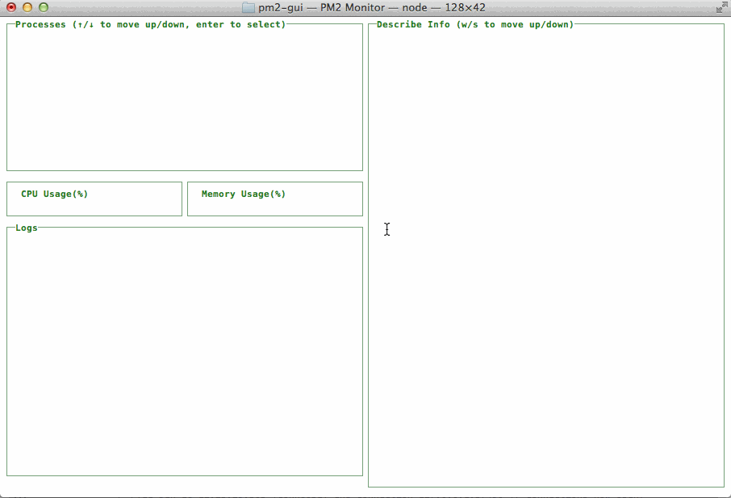
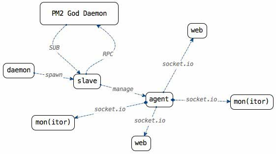
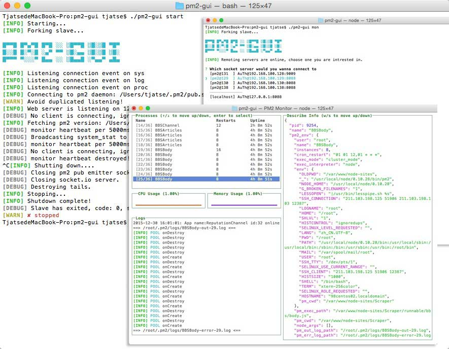
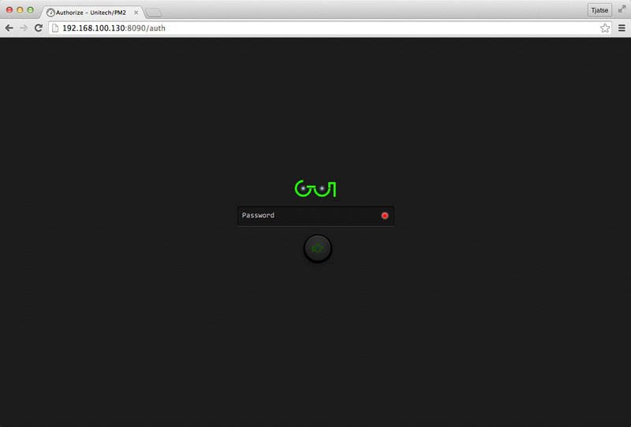
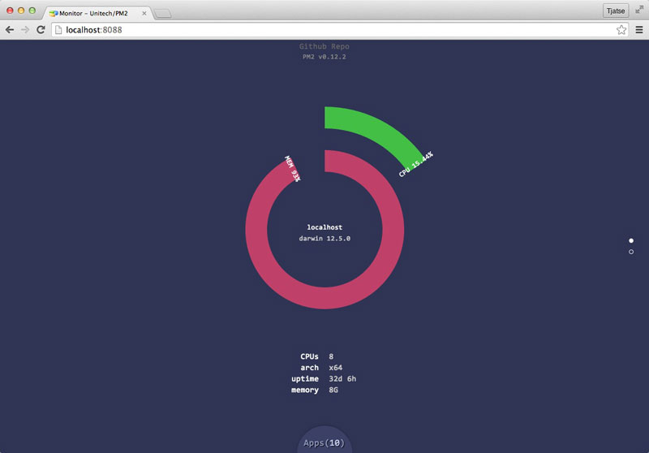
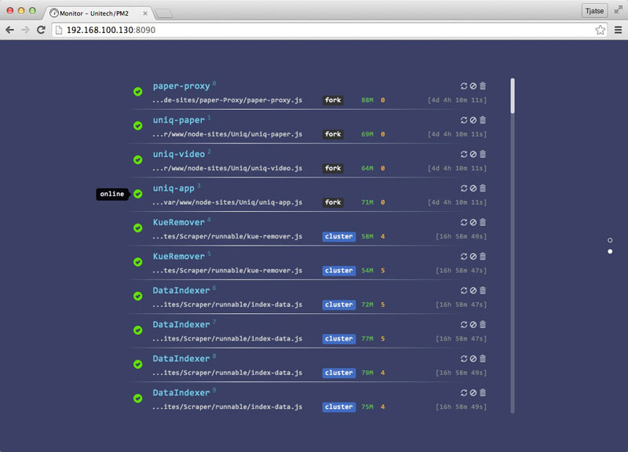
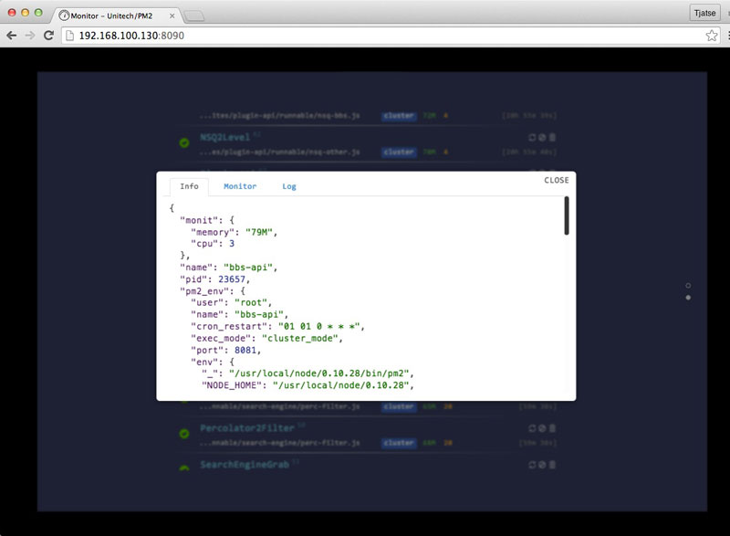
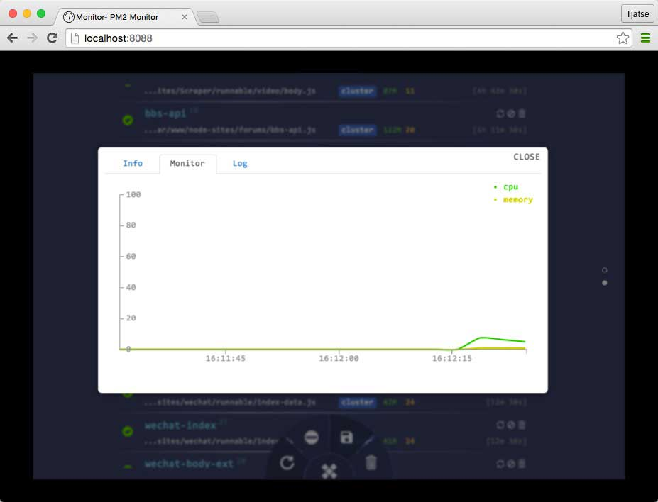
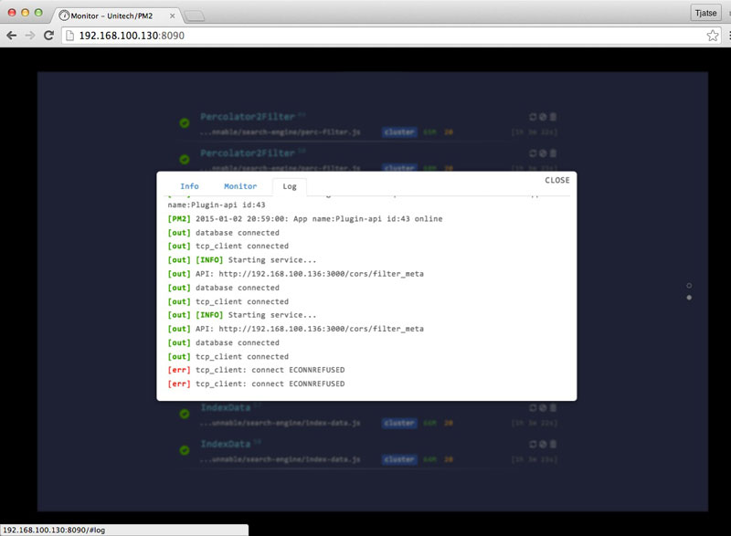

pm2-gui [](http://badge.fury.io/js/pm2-gui) [](https://travis-ci.org/Tjatse/pm2-gui)
=======

An elegant web & terminal interface for Unitech/PM2.

> Compatible with PM2 v0.12.7+

> If you wanna update to pm2-gui@latest, make sure you've read the [change logs](CHANGELOG.md).

> You can track lifecycle by [pm2-ant](https://github.com/Tjatse/pm2-ant)



# Guide
- [Features](#feats)
- [Cautions](#cauts)
- [Installation](#ins)
- [Usage](#usage)
- [Configuration](#config)
- [Authorization](#auth)
- [UI/UX](#ui)
- [Serving apps locally with nginx and custom domain](#serv)



<a name="feats"></a>
# Features

- Curses-like dashboard.
- Remoting monitor / web control.
- All the heartbeats (no matter **monitor** or **tail (logs)**) are automatic destroyed.
- The `PM2` processes are watched by a subscribed emitter.
- Communicated with `PM2` through **RPC** socket directly.
- Socket.io between client and server.
- Monitor CPU and Memory usage of server in a real-time.
- Monitor `PM2` processes in a real-time.
- PM2 *restart/stop/delete*.
 - *stopWatch* files before *restart/stop/delete*.
 - *restartWatch* files before *restart*.
- Supports [ANSI color codes](#ss_logs) by [ansi-html](https://github.com/Tjatse/ansi-html).
- High performance. In my case, there are near one hundred processes, but `pm2-gui` works without any suck.

<a name="cauts"></a>
# Cautions

- Web Interface is wrote by CSS3 && HTML5, so view it with the latest version of the browser (WebGL, Animation, WebSocket supports), e.g. Chrome, Safari and Firefox.
- I've never test it on Internet Explorer / Windows.

<a name="ins"></a>
# Installation

```bash
$ npm install pm2-gui -g
$ pm2-gui <cmd> [options]
# or
$ npm install pm2-gui --production
$ cd node_modules/pm2-gui
# or (recommends)
$ git clone https://github.com/Tjatse/pm2-gui.git
$ cd pm2-gui
$ npm install --production
# run monitor
$ ./pm2-gui <cmd> [options]
```

<a name="usage"></a>
# Usage

Run the following command to get usage helps:
```bash
$ pm2-gui
```

Directly:
```bash
$ node pm2-gui.js <cmd> [options]
```

Programmable:
```javascript
var pm2GUI = require('pm2-gui');
pm2GUI.startWebServer([ini_config_file]);
pm2GUI.startAgent([ini_config_file]);
pm2GUI.dashboard([ini_config_file]);
```

<a name="config"></a>
# Configuration

Edit the `pm2-gui/pm2-gui.ini` file or copy the [config example](./pm2-gui.ini) to `/etc/pm2-gui.ini` (starting with `pm2-gui start /etc/pm2-gui.ini`):

<a name="ui"></a>
# UI/UX

- Amazing and smooth animations.
- High performance.

Curses-like dashboard:



Authorization



Home



Processes



Describe Complete Information



CPU && Memory Usage



Tail Logs



<a name="serv"></a>

# Serving apps locally with nginx and custom domain
- [simple](examples/nginx/pm.example.com.conf)
- [advanced](examples/nginx/pm2.example.com.conf)

## Test
```bash
$ npm test
```

## License
(The MIT License)

Copyright (c) 2014-2016 Tjatse

Permission is hereby granted, free of charge, to any person obtaining a copy of this software and associated documentation files (the 'Software'), to deal in the Software without restriction, including without limitation the rights to use, copy, modify, merge, publish, distribute, sublicense, and/or sell copies of the Software, and to permit persons to whom the Software is furnished to do so, subject to the following conditions:

The above copyright notice and this permission notice shall be included in all copies or substantial portions of the Software.

THE SOFTWARE IS PROVIDED 'AS IS', WITHOUT WARRANTY OF ANY KIND, EXPRESS OR IMPLIED, INCLUDING BUT NOT LIMITED TO THE WARRANTIES OF MERCHANTABILITY, FITNESS FOR A PARTICULAR PURPOSE AND NONINFRINGEMENT. IN NO EVENT SHALL THE AUTHORS OR COPYRIGHT HOLDERS BE LIABLE FOR ANY CLAIM, DAMAGES OR OTHER LIABILITY, WHETHER IN AN ACTION OF CONTRACT, TORT OR OTHERWISE, ARISING FROM, OUT OF OR IN CONNECTION WITH THE SOFTWARE OR THE USE OR OTHER DEALINGS IN THE SOFTWARE.

