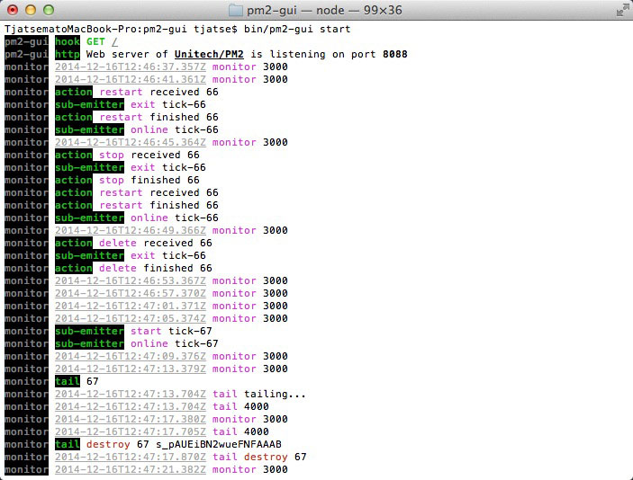
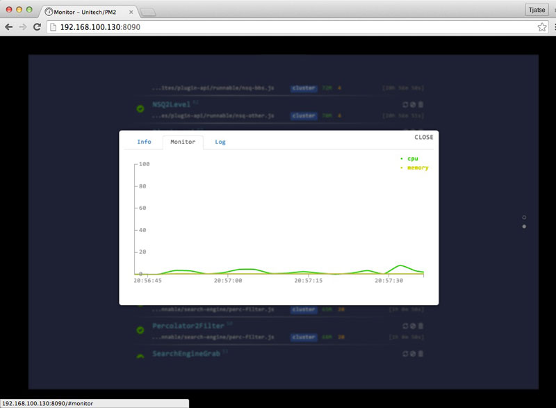

pm2-gui [](http://badge.fury.io/js/pm2-gui) [](https://travis-ci.org/Tjatse/pm2-gui)
=======

An elegant web interface for Unitech/PM2.

> Compatible with PM2 v0.12.3.

# Guide
- [Features](#feats)
- [Cautions](#cauts)
- [Installation](#ins)
- [CLI](#cli)
  - [Run Web Interface](#cli_web)
  - [Configs](#cli_confs)
- [Authorization](#auth)
- [UI/UX](#ui)

<a name="feats" />
# Features
- All the heartbeats (no matter **monitor** or **tail (logs)**) are automatic destroyed.
- The `PM2` processes are watched by a subscribed emitter.
- Communicated with `PM2` through **RPC** socket directly.
- Socket.io between client and server.
- Monitor CPU and Memory usage of server in a real-time.
- Monitor `PM2` processes in a real-time.
- PM2 *restart/stop/delete*.
 - *stopWatch* files before *restart/stop/delete*
 - *restartWatch* files before *restart*
- Supports [ANSI color codes](#tail_logs) by [ansi-html](https://github.com/Tjatse/ansi-html).

<a name="cauts" />
# Cautions
- Web Interface is wrote by CSS3 && HTML5, so view it with the latest version of the browser (WebGL, Animation, WebSocket supports), e.g. Chrome, Safari and Firefox.
- I've never test it on Internet Explorer / Windows.

<a name="ins" />
# Installation
```
$ npm install -g pm2-gui
```

<a name="cli" />
# CLI
```
  Usage: pm2-gui [cmd] [options]

  Commands:

    start [options] [port]  Launch the web server, port default by 8088
    config                  show all configs
    set <key> <value>       set config by key-value pairs
    rm <key>                remove config by key

  Options:

    -h, --help     output usage information
    -v, --version  output the version number

  Basic Examples:

    Start the web server, by default port (8088):
    $ pm2-gui start

    Start the web server, by specific port (8090):
    $ pm2-gui start 8090

```

<a name="cli_web" />
## Run Web Interface
```bash
  Usage: start [options] [port]

  Options:

    -h, --help       output usage information
    --config [file]  pass JSON config file with options
    --no-debug  hide stdout/stderr information
    --config    path to custom .json config. Default value pm2-gui.json
```

<a name="cli_confs" />
## Configs
```javascript
{
  "refresh": 3000,
  "manipulation": true,
  "pm2": "~/.pm2",
  "port": 8088
}
```

- **refresh** The heartbeat duration of monitor (backend), `5000` by default.
- **manipulation** A value indicates whether the client has permission to restart/stop processes, `true` by default.
- **pm2** Root directory of Unitech/PM2, `~/.pm2` by default.
- **password** The encrypted authentication code, if this config is set, users need to be authorized before accessing the index page, `password` could only be set by `pm2-gui set password [password]`.
- **port** Port of web interface.

### Config file
You can quit set configurations by `pm2-gui start --config [file]`, the `[file]` must be an valid JSON, and can including all the above keys.

Example
```bash
# Load the JSON configured file which is named as `pm2-gui.json` in current directory.
$ pm2-gui start --config

# Load the specific JSON configured file in current directory.
$ pm2-gui start --config conf.json
```

### Set Config
Usage
```bash
$ pm2-gui set <key> <value>
```

Example
```bash
$ pm2-gui set refresh 2000
```

Above command will set `refresh` to 2 seconds.

### Remove Config
Usage
```bash
$ pm2-gui rm <key>
```

Example
```bash
$ pm2-gui rm refresh
```

Above command will remove `refresh` config and it will be set to `5000` (milliseconds) by default.

<a name="auth" />
# Authorization
Run the following commands:
```bash
$ pm2-gui set password 1234
$ pm2-gui start
```

When you visiting `http://[domain]:8088` in your browser, it will be redirected to `http://[domain]:8088/auth`, and you need to typo the password (`1234`) to login.

Otherwise, if you do not want to deny anybody, just simply remove it:
```bash
$ pm2-gui rm password
$ pm2-gui start
```

<a name="ui" />
# UI/UX
- Amazing and smooth animations.
- High performance.

Some screenshots:

Backend (without `--no-debug` option):



Login


Home


Processes


Describe Complete Information


CPU && Memory Usage



Tail Logs


## Test
```bash
$ npm test
```

## License
Licensed under the Apache License, Version 2.0 (the "License");
you may not use this file except in compliance with the License.
You may obtain a copy of the License at

    http://www.apache.org/licenses/LICENSE-2.0

Unless required by applicable law or agreed to in writing, software
distributed under the License is distributed on an "AS IS" BASIS,
WITHOUT WARRANTIES OR CONDITIONS OF ANY KIND, either express or implied.
See the License for the specific language governing permissions and
limitations under the License.

